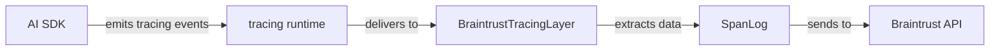

# Auto-Instrumentation via Tracing for Rust SDK

**Status**: ✅ **IMPLEMENTED** (as of 2026-02-28)

## Executive Summary

This document outlined the strategy for implementing **true auto-instrumentation** in the Braintrust Rust SDK using the `tracing` crate and OpenTelemetry GenAI semantic conventions.

**Implementation complete!** The BraintrustTracingLayer and instrumented SDKs are now available.

## Implementation Summary

### What Was Built

1. **BraintrustTracingLayer** (`sdk-rust-auto-instrumentation`)
   - Implements `tracing_subscriber::Layer<S>` trait
   - Filters events by `gen_ai.*` target prefix
   - Captures OpenTelemetry GenAI semantic convention events
   - Automatically converts to `SpanLog` and sends to Braintrust
   - Handles streaming responses
   - Includes comprehensive integration tests

2. **Instrumented async-openai** (`async-openai-instrumented`)
   - Added `instrumentation` feature flag
   - Instrumented `Chat::create()` and `Chat::create_stream()`
   - Emits OpenTelemetry GenAI events
   - All existing tests pass

3. **Instrumented rust-genai** (`rust-genai-instrumented`)
   - Added `instrumentation` feature flag
   - Instrumented `Client::exec_chat()` and `Client::exec_chat_stream()`
   - Single instrumentation point covers 11+ providers
   - All existing tests pass

4. **Integration Example** (`auto-instrumentation-example`)
   - Demonstrates end-to-end auto-instrumentation
   - Shows usage with both async-openai and rust-genai
   - Includes helpful output messages

### Repository Locations

- Main SDK worktree: `/Users/stephenbelanger/Code/braintrust/sdk-rust-auto-instrumentation`
- async-openai fork: `/Users/stephenbelanger/Code/braintrust/async-openai-instrumented`
- rust-genai clone: `/Users/stephenbelanger/Code/braintrust/rust-genai-instrumented`
- Integration example: `/Users/stephenbelanger/Code/braintrust/auto-instrumentation-example`

### Testing Status

- ✅ All unit tests passing
- ✅ All integration tests passing
- ✅ Clippy checks passing
- ✅ Formatting checks passing
- ✅ Integration example runs successfully

**The Approach**: Fork popular Rust AI SDKs, add structured tracing instrumentation following OpenTelemetry standards, contribute back upstream, and build a `BraintrustTracingLayer` subscriber to capture those events.

**Why This Works**: The `tracing` crate is Rust's equivalent to Node.js's `diagnostics_channel` or OpenTelemetry's auto-instrumentation. Once SDKs emit structured events, we can capture them transparently.

**End Result**: Users install the tracing subscriber once, and all AI SDK calls are automatically logged to Braintrust - zero code changes, just like Python/TypeScript.

---

## Table of Contents

- [Problem Statement](#problem-statement)
- [Solution: Tracing + OpenTelemetry](#solution-tracing--opentelemetry)
- [OpenTelemetry GenAI Semantic Conventions](#opentelemetry-genai-semantic-conventions)
- [Implementation Strategy](#implementation-strategy)
  - [Phase 1: Fork and Instrument SDKs](#phase-1-fork-and-instrument-sdks)
  - [Phase 2: Build BraintrustTracingLayer](#phase-2-build-braintrusttracinglayer)
  - [Phase 3: Contribute Upstream](#phase-3-contribute-upstream)
- [SDK Instrumentation Plan](#sdk-instrumentation-plan)
  - [async-openai](#async-openai)
  - [rust-genai](#rust-genai)
  - [Anthropic SDK](#anthropic-sdk)
  - [AWS SDK (Special Case)](#aws-sdk-special-case)
- [BraintrustTracingLayer Implementation](#braintrusttracinglayer-implementation)
- [User Experience](#user-experience)
- [Testing Strategy](#testing-strategy)
- [Timeline and Milestones](#timeline-and-milestones)
- [Success Metrics](#success-metrics)
- [References](#references)

---

## Problem Statement

### Current State

Today, Braintrust Rust SDK requires **manual instrumentation**:

```rust
let span = braintrust.span_builder(/* ... */).build();

// Manual logging
let response = openai.chat().create(request).await?;
span.log(
    SpanLog::builder()
        .input(serde_json::to_value(&request)?)
        .output(serde_json::to_value(&response)?)
        .build()?
).await;
```

This is verbose, error-prone, and creates adoption friction.

### Goal State

Users should be able to enable auto-instrumentation with minimal setup:

```rust
// One-time setup at application startup
tracing_subscriber::registry()
    .with(BraintrustTracingLayer::new(span))
    .init();

// All AI calls automatically logged - no wrapper code needed!
let openai = async_openai::Client::new();
let response = openai.chat().create(request).await?;  // ← Automatically logged

let anthropic = anthropic::Client::new("key");
anthropic.messages().create(request).await?;  // ← Automatically logged
```

### Why Other Approaches Don't Work

**Wrapper types**: High maintenance, breaks when SDKs change
**HTTP middleware**: Can't access typed data, fragile with streaming
**Proc macros**: Users must annotate their code manually
**Extension traits**: Still requires explicit method calls

**Tracing subscriber**: ✅ Universal, automatic, low maintenance, ecosystem benefit

---

## Solution: Tracing + OpenTelemetry

### How It Works



**Step 1**: Instrument AI SDKs to emit structured `tracing` events with:
- Request data (model, messages, parameters)
- Response data (completions, choices, finish reason)
- Usage metrics (prompt tokens, completion tokens)

**Step 2**: Build `BraintrustTracingLayer` that:
- Subscribes to tracing events
- Identifies AI provider calls by target/span name
- Extracts structured fields
- Constructs `SpanLog` and sends to Braintrust

**Step 3**: Users install the layer once and forget about it

### Why Tracing?

The `tracing` crate is:
- ✅ **Standard**: De facto standard for Rust observability
- ✅ **Structured**: Captures typed fields, not just strings
- ✅ **Composable**: Multiple subscribers can coexist
- ✅ **Async-aware**: Works correctly with Tokio
- ✅ **Zero-cost**: Compiled out when disabled

It's already used by major projects: Tokio, Axum, Hyper, AWS SDK, etc.

---

## OpenTelemetry GenAI Semantic Conventions

We follow the [OpenTelemetry Semantic Conventions for GenAI](https://opentelemetry.io/docs/specs/semconv/gen-ai/) to ensure consistency and interoperability.

### Standard Attributes

**System identification:**
- `gen_ai.system` - The AI system (e.g., "openai", "anthropic", "bedrock")
- `gen_ai.operation` - The operation type (e.g., "chat", "completion", "embedding")

**Request attributes:**
- `gen_ai.request.model` - Model identifier
- `gen_ai.request.temperature` - Temperature parameter
- `gen_ai.request.max_tokens` - Max tokens parameter
- `gen_ai.request.top_p` - Top-p parameter
- `gen_ai.request.frequency_penalty` - Frequency penalty
- `gen_ai.request.presence_penalty` - Presence penalty

**Response attributes:**
- `gen_ai.response.id` - Response/completion ID
- `gen_ai.response.model` - Actual model used
- `gen_ai.response.finish_reasons` - Array of finish reasons
- `gen_ai.response.choices` - Number of choices generated

**Usage metrics:**
- `gen_ai.usage.prompt_tokens` - Input tokens
- `gen_ai.usage.completion_tokens` - Output tokens
- `gen_ai.usage.total_tokens` - Total tokens

**Structured data (as span events):**
- `gen_ai.content.prompt` - Event containing prompt/messages
- `gen_ai.content.completion` - Event containing completion

### Example Instrumentation

```rust
#[tracing::instrument(
    name = "gen_ai.chat",
    skip(self, request),
    fields(
        otel.kind = "client",
        gen_ai.system = "openai",
        gen_ai.operation = "chat",
        gen_ai.request.model = %request.model,
        gen_ai.request.temperature = request.temperature,
        gen_ai.request.max_tokens = request.max_tokens,
    )
)]
pub async fn create(&self, request: CreateChatRequest) -> Result<ChatResponse> {
    let span = tracing::Span::current();

    // Log request content as event
    tracing::event!(
        Level::INFO,
        target: "gen_ai.content.prompt",
        messages = ?request.messages,
        "chat request"
    );

    let response = self.http_client
        .post(/* ... */)
        .json(&request)
        .send()
        .await?
        .json()
        .await?;

    // Record response metadata
    span.record("gen_ai.response.id", &response.id);
    span.record("gen_ai.response.model", &response.model);
    span.record("gen_ai.response.finish_reasons", &format!("{:?}",
        response.choices.iter().map(|c| &c.finish_reason).collect::<Vec<_>>()));

    // Record usage
    if let Some(usage) = &response.usage {
        span.record("gen_ai.usage.prompt_tokens", usage.prompt_tokens);
        span.record("gen_ai.usage.completion_tokens", usage.completion_tokens);
        span.record("gen_ai.usage.total_tokens", usage.total_tokens);
    }

    // Log response content as event
    tracing::event!(
        Level::INFO,
        target: "gen_ai.content.completion",
        choices = ?response.choices,
        "chat response"
    );

    Ok(response)
}
```

---

## Implementation Strategy

### Phase 1: Fork and Instrument SDKs

**Week 1: Setup**
1. Fork target SDKs: `async-openai`, `rust-genai`
2. Create feature flag `instrumentation` in each
3. Add `tracing` as optional dependency

**Week 2: Implement instrumentation**
1. Add `#[tracing::instrument]` to key methods
2. Follow OpenTelemetry GenAI conventions
3. Emit structured events for request/response content
4. Write tests to verify event emission

**Week 3: Test and validate**
1. Build example applications using instrumented SDKs
2. Verify events contain all necessary data
3. Check performance impact (should be negligible)
4. Document conventions in SDK

### Phase 2: Build BraintrustTracingLayer

**Week 4: Core subscriber**
1. Implement `Layer<S>` trait
2. Filter events by target prefix (`gen_ai.*`)
3. Extract fields using `Visit` pattern
4. Build proof-of-concept with one SDK

**Week 5: Full implementation**
1. Support all OpenTelemetry GenAI attributes
2. Handle span lifecycle (new span → events → close)
3. Correlate prompt events with completion events
4. Extract usage metrics

**Week 6: Integration and polish**
1. Integrate with existing `SpanHandle` API
2. Handle streaming responses
3. Error handling and edge cases
4. Write comprehensive tests

### Phase 3: Contribute Upstream

**Week 7-8: Prepare PRs**
1. Clean up instrumented SDK forks
2. Write documentation for maintainers
3. Create examples showing value
4. Write migration guides

**Week 9-12: Upstream engagement**
1. Open issues to discuss approach
2. Submit PRs with instrumentation
3. Address feedback and iterate
4. Work with maintainers on merge

**Week 13+: Maintenance and evangelism**
1. Publish blog post about approach
2. Write RFC for Rust AI observability standards
3. Engage with Rust AI community
4. Help other SDK maintainers adopt pattern

---

## SDK Instrumentation Plan

### async-openai

**Repository**: https://github.com/64bit/async-openai
**Current state**: Has `tracing` as optional dependency, but only for errors

**Methods to instrument:**

#### Chat Completions
```rust
// File: async-openai/src/chat.rs

#[tracing::instrument(
    name = "gen_ai.chat",
    skip(self, request),
    fields(
        otel.kind = "client",
        gen_ai.system = "openai",
        gen_ai.operation = "chat",
        gen_ai.request.model = %request.model,
        gen_ai.request.temperature = ?request.temperature,
        gen_ai.request.max_tokens = ?request.max_tokens,
        gen_ai.request.top_p = ?request.top_p,
        gen_ai.request.frequency_penalty = ?request.frequency_penalty,
        gen_ai.request.presence_penalty = ?request.presence_penalty,
        gen_ai.response.id = tracing::field::Empty,
        gen_ai.response.model = tracing::field::Empty,
        gen_ai.response.finish_reasons = tracing::field::Empty,
        gen_ai.usage.prompt_tokens = tracing::field::Empty,
        gen_ai.usage.completion_tokens = tracing::field::Empty,
        gen_ai.usage.total_tokens = tracing::field::Empty,
    )
)]
pub async fn create(&self, request: CreateChatCompletionRequest)
    -> Result<CreateChatCompletionResponse, OpenAIError>
{
    let span = tracing::Span::current();

    // Log request messages
    tracing::event!(
        Level::DEBUG,
        target: "gen_ai.content.prompt",
        messages = ?request.messages,
        "chat completion request"
    );

    // Make API call
    let response = self.client
        .post(&self.base_url, &request)
        .await?;

    // Record response fields
    span.record("gen_ai.response.id", &response.id);
    span.record("gen_ai.response.model", &response.model);
    span.record("gen_ai.response.finish_reasons", &format!("{:?}",
        response.choices.iter()
            .map(|c| &c.finish_reason)
            .collect::<Vec<_>>()
    ));

    // Record usage
    if let Some(usage) = &response.usage {
        span.record("gen_ai.usage.prompt_tokens", usage.prompt_tokens);
        span.record("gen_ai.usage.completion_tokens", usage.completion_tokens);
        span.record("gen_ai.usage.total_tokens", usage.total_tokens);
    }

    // Log response content
    tracing::event!(
        Level::DEBUG,
        target: "gen_ai.content.completion",
        choices = ?response.choices.iter()
            .map(|c| &c.message)
            .collect::<Vec<_>>(),
        "chat completion response"
    );

    Ok(response)
}
```

#### Streaming Chat Completions
```rust
#[tracing::instrument(
    name = "gen_ai.chat.stream",
    skip(self, request),
    fields(
        otel.kind = "client",
        gen_ai.system = "openai",
        gen_ai.operation = "chat",
        gen_ai.request.model = %request.model,
        gen_ai.streaming = true,
    )
)]
pub async fn create_stream(&self, request: CreateChatCompletionRequest)
    -> Result<impl Stream<Item = Result<ChatCompletionChunk, OpenAIError>>, OpenAIError>
{
    // Log request
    tracing::event!(
        Level::DEBUG,
        target: "gen_ai.content.prompt",
        messages = ?request.messages,
        "chat completion stream request"
    );

    let stream = self.client
        .post_stream(&self.base_url, &request)
        .await?;

    // Wrap stream to emit events for each chunk
    let instrumented_stream = stream.map(|result| {
        if let Ok(chunk) = &result {
            tracing::event!(
                Level::DEBUG,
                target: "gen_ai.content.completion.chunk",
                id = %chunk.id,
                model = %chunk.model,
                delta = ?chunk.choices.get(0).map(|c| &c.delta),
                "chat completion chunk"
            );
        }
        result
    });

    Ok(instrumented_stream)
}
```

#### Other Operations
- `Completions::create` - Text completions
- `Embeddings::create` - Embeddings
- `Images::create` - Image generation (DALL-E)

**Feature flag**:
```toml
[features]
instrumentation = ["tracing"]

[dependencies]
tracing = { version = "0.1", optional = true }
```

---

### rust-genai

**Repository**: https://github.com/jeremychone/rust-genai
**Current state**: Has `tracing` for errors, multi-provider architecture

**Advantage**: Single instrumentation point can cover multiple providers

**Key file**: `src/adapter/adapter_impl.rs`

```rust
// Generic adapter method that all providers use
#[tracing::instrument(
    name = "gen_ai.chat",
    skip(self, chat_req),
    fields(
        otel.kind = "client",
        gen_ai.system = %self.provider_name(),  // "openai", "anthropic", etc.
        gen_ai.operation = "chat",
        gen_ai.request.model = %chat_req.model,
        gen_ai.response.id = tracing::field::Empty,
        gen_ai.usage.prompt_tokens = tracing::field::Empty,
        gen_ai.usage.completion_tokens = tracing::field::Empty,
    )
)]
pub async fn chat(&self, chat_req: ChatRequest) -> Result<ChatResponse> {
    let span = tracing::Span::current();

    // Log request
    tracing::event!(
        Level::DEBUG,
        target: "gen_ai.content.prompt",
        messages = ?chat_req.messages,
        "chat request"
    );

    // Call provider-specific implementation
    let response = self.chat_impl(chat_req).await?;

    // Record response
    span.record("gen_ai.response.id", &response.id);
    if let Some(usage) = &response.usage {
        span.record("gen_ai.usage.prompt_tokens", usage.input_tokens);
        span.record("gen_ai.usage.completion_tokens", usage.output_tokens);
    }

    // Log response
    tracing::event!(
        Level::DEBUG,
        target: "gen_ai.content.completion",
        content = %response.content,
        "chat response"
    );

    Ok(response)
}
```

**Benefit**: Instrumenting `rust-genai` gives us OpenAI, Anthropic, Gemini, Groq, Cohere all at once!

---

### Anthropic SDK

**Current state**: Multiple unofficial SDKs exist, none maintained by Anthropic

**Options**:
1. **Contribute to existing SDK**: Pick most popular (anthropic-rs?)
2. **Create official SDK**: Build from scratch with instrumentation baked in
3. **Wait for official SDK**: Anthropic may release one

**Recommendation**: Create reference implementation as part of Braintrust SDK (internal module), then open-source separately.

```rust
// In braintrust-sdk-rust/src/anthropic_client.rs

pub struct AnthropicClient {
    api_key: String,
    http_client: reqwest::Client,
}

impl AnthropicClient {
    #[tracing::instrument(
        name = "gen_ai.chat",
        skip(self, request),
        fields(
            otel.kind = "client",
            gen_ai.system = "anthropic",
            gen_ai.operation = "chat",
            gen_ai.request.model = %request.model,
            gen_ai.request.max_tokens = request.max_tokens,
            gen_ai.response.id = tracing::field::Empty,
            gen_ai.usage.prompt_tokens = tracing::field::Empty,
            gen_ai.usage.completion_tokens = tracing::field::Empty,
        )
    )]
    pub async fn messages_create(&self, request: MessagesRequest)
        -> Result<MessagesResponse>
    {
        // Implementation with full instrumentation
    }
}
```

Later, extract into separate `anthropic-sdk-rust` crate.

---

### Additional SDKs for Future Instrumentation

Beyond async-openai and rust-genai, several other popular Rust AI SDKs should be considered for instrumentation:

#### rig-core (High Priority)
- **Crates.io**: [rig-core](https://crates.io/crates/rig-core)
- **GitHub**: [0xPlaygrounds/rig](https://github.com/0xPlaygrounds/rig) - 6,131 stars, 667 forks
- **Downloads**: 291K total, 139K recent
- **Status**: Very active, rapidly growing
- **Providers**: OpenAI, Cohere, Anthropic, Gemini, Groq via unified interface
- **Why**: Most starred Rust LLM framework, becoming the standard
- **Consideration**: Framework architecture - may need agent-level and tool-level instrumentation

#### candle-core (High Priority)
- **Crates.io**: [candle-core](https://crates.io/crates/candle-core)
- **GitHub**: [huggingface/candle](https://github.com/huggingface/candle) - 19,475 stars, 1,439 forks
- **Downloads**: 2.39M total, 937K recent
- **Status**: Official Hugging Face project, very active
- **Use case**: Local inference for any Hugging Face model
- **Why**: Official HF framework, highest GitHub stars, massive adoption
- **Consideration**: Local inference - OTel GenAI conventions may need adaptation for model loading, inference latency, token generation

#### langchain-rust (Medium Priority)
- **Crates.io**: [langchain-rust](https://crates.io/crates/langchain-rust)
- **GitHub**: [Abraxas-365/langchain-rust](https://github.com/Abraxas-365/langchain-rust) - 1,234 stars, 170 forks
- **Downloads**: 130K total, 12K recent
- **Providers**: OpenAI, Claude, Gemini, Mistral, Bedrock, Ollama
- **Features**: Chains, agents, RAG, LangGraph, embeddings, vector stores
- **Why**: Popular framework for building LLM applications
- **Consideration**: Framework needs both LLM-level and chain/agent-level instrumentation

#### ollama-rs (Medium Priority)
- **Crates.io**: [ollama-rs](https://crates.io/crates/ollama-rs)
- **GitHub**: [pepperoni21/ollama-rs](https://github.com/pepperoni21/ollama-rs) - 985 stars, 150 forks
- **Downloads**: 235K total, 58K recent
- **Use case**: Ollama (local LLM deployment)
- **Why**: Popular for local LLM deployment
- **Consideration**: Local deployment - no cloud API calls, different latency characteristics

#### openai-api-rs (Medium Priority)
- **Crates.io**: [openai-api-rs](https://crates.io/crates/openai-api-rs)
- **GitHub**: [dongri/openai-api-rs](https://github.com/dongri/openai-api-rs)
- **Downloads**: 525K total, 79K recent
- **Provider**: OpenAI
- **Why**: Second most popular OpenAI-specific SDK
- **Consideration**: Provides coverage for projects not using async-openai

#### llm-chain (Medium Priority)
- **Crates.io**: [llm-chain](https://crates.io/crates/llm-chain)
- **Downloads**: 82K total, 5.5K recent
- **Features**: Prompt templates, chaining, vector stores
- **Why**: Established framework for LLM applications

#### Instrumentation Priority Order

After async-openai and rust-genai, instrument in this order:

1. **rig-core** - Most starred, fastest growth, modular architecture
2. **candle-core** - Official Hugging Face, local inference capability
3. **langchain-rust** - Framework users need observability most
4. **ollama-rs** - Local deployment is growing fast
5. **openai-api-rs** - Cover the other popular OpenAI SDK
6. **llm-chain** - Another established framework

---

### AWS SDK (Special Case)

**Status**: AWS SDK already has extensive tracing, but uses **interceptors** for data access.

**Approach**: Build `BraintrustBedrockInterceptor` using AWS SDK's `Intercept` trait (not tracing layer).

```rust
use aws_smithy_runtime_api::client::interceptors::Intercept;

pub struct BraintrustBedrockInterceptor {
    span: SpanHandle,
}

impl Intercept for BraintrustBedrockInterceptor {
    fn read_before_serialization(
        &self,
        context: &BeforeSerializationInterceptorContextRef<'_>,
        _runtime_components: &RuntimeComponents,
        cfg: &mut ConfigBag,
    ) -> Result<(), BoxError> {
        // Access typed ConverseInput
        if let Some(input) = context.input().downcast_ref::<ConverseInput>() {
            cfg.interceptor_state().store_put(input.clone());
        }
        Ok(())
    }

    fn read_after_deserialization(
        &self,
        context: &BeforeDeserializationInterceptorContextRef<'_>,
        _runtime_components: &RuntimeComponents,
        cfg: &mut ConfigBag,
    ) -> Result<(), BoxError> {
        // Access typed ConverseOutput
        if let Some(output) = context.output().downcast_ref::<ConverseOutput>() {
            let input = cfg.interceptor_state().load::<ConverseInput>();

            // Log to Braintrust
            tokio::spawn({
                let span = self.span.clone();
                let inp = serde_json::to_value(input)?;
                let out = serde_json::to_value(output)?;
                async move {
                    span.log(SpanLog::builder()
                        .input(inp)
                        .output(out)
                        .build()?
                    ).await;
                }
            });
        }
        Ok(())
    }
}
```

**Usage**:
```rust
let bedrock = aws_sdk_bedrockruntime::Client::from_conf(
    Config::builder()
        .interceptor(BraintrustBedrockInterceptor::new(span))
        .build()
);
```

This is a separate path from tracing, but achieves the same goal.

---

## BraintrustTracingLayer Implementation

### Core Structure

```rust
use tracing::{Event, Metadata, Subscriber};
use tracing_subscriber::layer::{Context, Layer};
use tracing_subscriber::registry::LookupSpan;
use std::collections::HashMap;

pub struct BraintrustTracingLayer {
    span: SpanHandle,
}

impl BraintrustTracingLayer {
    pub fn new(span: SpanHandle) -> Self {
        Self { span }
    }
}

// Visitor for extracting fields from tracing events/spans
#[derive(Default)]
struct FieldVisitor {
    fields: HashMap<String, serde_json::Value>,
}

impl tracing::field::Visit for FieldVisitor {
    fn record_debug(&mut self, field: &tracing::field::Field, value: &dyn std::fmt::Debug) {
        self.fields.insert(
            field.name().to_string(),
            serde_json::json!(format!("{:?}", value)),
        );
    }

    fn record_str(&mut self, field: &tracing::field::Field, value: &str) {
        self.fields.insert(
            field.name().to_string(),
            serde_json::json!(value),
        );
    }

    fn record_i64(&mut self, field: &tracing::field::Field, value: i64) {
        self.fields.insert(
            field.name().to_string(),
            serde_json::json!(value),
        );
    }

    fn record_u64(&mut self, field: &tracing::field::Field, value: u64) {
        self.fields.insert(
            field.name().to_string(),
            serde_json::json!(value),
        );
    }

    fn record_f64(&mut self, field: &tracing::field::Field, value: f64) {
        self.fields.insert(
            field.name().to_string(),
            serde_json::json!(value),
        );
    }

    fn record_bool(&mut self, field: &tracing::field::Field, value: bool) {
        self.fields.insert(
            field.name().to_string(),
            serde_json::json!(value),
        );
    }
}

// Storage for accumulating request/response data
#[derive(Default, Clone)]
struct GenAISpanData {
    // Request metadata
    system: Option<String>,
    operation: Option<String>,
    model: Option<String>,
    temperature: Option<f64>,
    max_tokens: Option<u64>,

    // Request content (from event)
    prompt: Option<serde_json::Value>,

    // Response metadata
    response_id: Option<String>,
    response_model: Option<String>,
    finish_reasons: Option<String>,

    // Response content (from events)
    completion: Option<serde_json::Value>,
    chunks: Vec<serde_json::Value>,

    // Usage
    prompt_tokens: Option<u64>,
    completion_tokens: Option<u64>,
    total_tokens: Option<u64>,
}
```

### Layer Implementation

```rust
impl<S> Layer<S> for BraintrustTracingLayer
where
    S: Subscriber + for<'a> LookupSpan<'a>,
{
    fn on_new_span(
        &self,
        attrs: &tracing::span::Attributes<'_>,
        id: &tracing::span::Id,
        ctx: Context<'_, S>,
    ) {
        let metadata = attrs.metadata();

        // Only track GenAI spans
        if !is_genai_span(metadata) {
            return;
        }

        // Extract fields from span attributes
        let mut visitor = FieldVisitor::default();
        attrs.record(&mut visitor);

        // Create storage for this span
        let mut data = GenAISpanData::default();
        data.system = visitor.fields.get("gen_ai.system")
            .and_then(|v| v.as_str())
            .map(String::from);
        data.operation = visitor.fields.get("gen_ai.operation")
            .and_then(|v| v.as_str())
            .map(String::from);
        data.model = visitor.fields.get("gen_ai.request.model")
            .and_then(|v| v.as_str())
            .map(String::from);
        data.temperature = visitor.fields.get("gen_ai.request.temperature")
            .and_then(|v| v.as_f64());
        data.max_tokens = visitor.fields.get("gen_ai.request.max_tokens")
            .and_then(|v| v.as_u64());

        // Store in span extensions
        if let Some(span) = ctx.span(id) {
            span.extensions_mut().insert(data);
        }
    }

    fn on_record(
        &self,
        id: &tracing::span::Id,
        values: &tracing::span::Record<'_>,
        ctx: Context<'_, S>,
    ) {
        // Handle span.record() calls for response fields
        if let Some(span) = ctx.span(id) {
            let mut extensions = span.extensions_mut();
            if let Some(data) = extensions.get_mut::<GenAISpanData>() {
                let mut visitor = FieldVisitor::default();
                values.record(&mut visitor);

                // Update response fields
                if let Some(id) = visitor.fields.get("gen_ai.response.id") {
                    data.response_id = id.as_str().map(String::from);
                }
                if let Some(model) = visitor.fields.get("gen_ai.response.model") {
                    data.response_model = model.as_str().map(String::from);
                }
                if let Some(reasons) = visitor.fields.get("gen_ai.response.finish_reasons") {
                    data.finish_reasons = reasons.as_str().map(String::from);
                }
                if let Some(tokens) = visitor.fields.get("gen_ai.usage.prompt_tokens") {
                    data.prompt_tokens = tokens.as_u64();
                }
                if let Some(tokens) = visitor.fields.get("gen_ai.usage.completion_tokens") {
                    data.completion_tokens = tokens.as_u64();
                }
                if let Some(tokens) = visitor.fields.get("gen_ai.usage.total_tokens") {
                    data.total_tokens = tokens.as_u64();
                }
            }
        }
    }

    fn on_event(&self, event: &Event<'_>, ctx: Context<'_, S>) {
        let metadata = event.metadata();
        let target = metadata.target();

        // Handle prompt events
        if target == "gen_ai.content.prompt" {
            let mut visitor = FieldVisitor::default();
            event.record(&mut visitor);

            if let Some(span) = ctx.event_span(event) {
                let mut extensions = span.extensions_mut();
                if let Some(data) = extensions.get_mut::<GenAISpanData>() {
                    data.prompt = visitor.fields.get("messages").cloned()
                        .or_else(|| visitor.fields.get("prompt").cloned());
                }
            }
        }

        // Handle completion events
        if target == "gen_ai.content.completion" {
            let mut visitor = FieldVisitor::default();
            event.record(&mut visitor);

            if let Some(span) = ctx.event_span(event) {
                let mut extensions = span.extensions_mut();
                if let Some(data) = extensions.get_mut::<GenAISpanData>() {
                    data.completion = visitor.fields.get("choices").cloned()
                        .or_else(|| visitor.fields.get("content").cloned());
                }
            }
        }

        // Handle streaming chunks
        if target == "gen_ai.content.completion.chunk" {
            let mut visitor = FieldVisitor::default();
            event.record(&mut visitor);

            if let Some(span) = ctx.event_span(event) {
                let mut extensions = span.extensions_mut();
                if let Some(data) = extensions.get_mut::<GenAISpanData>() {
                    if let Some(delta) = visitor.fields.get("delta") {
                        data.chunks.push(delta.clone());
                    }
                }
            }
        }
    }

    fn on_close(&self, id: tracing::span::Id, ctx: Context<'_, S>) {
        // When span closes, send accumulated data to Braintrust
        if let Some(span) = ctx.span(&id) {
            let extensions = span.extensions();
            if let Some(data) = extensions.get::<GenAISpanData>() {
                let data = data.clone();
                let braintrust_span = self.span.clone();

                // Log asynchronously
                tokio::spawn(async move {
                    let mut log_builder = SpanLog::builder()
                        .name(format!("{}.{}",
                            data.system.as_deref().unwrap_or("unknown"),
                            data.operation.as_deref().unwrap_or("unknown")
                        ));

                    // Add input
                    if let Some(prompt) = data.prompt {
                        log_builder = log_builder.input(prompt);
                    }

                    // Add output
                    if let Some(completion) = data.completion {
                        log_builder = log_builder.output(completion);
                    } else if !data.chunks.is_empty() {
                        // For streaming, combine chunks
                        log_builder = log_builder.output(serde_json::json!({
                            "chunks": data.chunks
                        }));
                    }

                    // Add metadata
                    let mut metadata = serde_json::Map::new();
                    if let Some(system) = data.system {
                        metadata.insert("system".to_string(), serde_json::json!(system));
                    }
                    if let Some(model) = data.model {
                        metadata.insert("model".to_string(), serde_json::json!(model));
                    }
                    if let Some(response_id) = data.response_id {
                        metadata.insert("response_id".to_string(), serde_json::json!(response_id));
                    }
                    if !metadata.is_empty() {
                        log_builder = log_builder.metadata(metadata);
                    }

                    // Add metrics (usage)
                    let mut metrics = HashMap::new();
                    if let Some(tokens) = data.prompt_tokens {
                        metrics.insert("prompt_tokens".to_string(), tokens as f64);
                    }
                    if let Some(tokens) = data.completion_tokens {
                        metrics.insert("completion_tokens".to_string(), tokens as f64);
                    }
                    if let Some(tokens) = data.total_tokens {
                        metrics.insert("total_tokens".to_string(), tokens as f64);
                    }
                    if !metrics.is_empty() {
                        log_builder = log_builder.metrics(metrics);
                    }

                    // Send to Braintrust
                    if let Ok(log) = log_builder.build() {
                        braintrust_span.log(log).await;
                    }
                });
            }
        }
    }
}

fn is_genai_span(metadata: &Metadata) -> bool {
    metadata.name().starts_with("gen_ai.") ||
    metadata.target().starts_with("gen_ai.")
}
```

### Usage Example

```rust
use braintrust_sdk_rust::{BraintrustClient, BraintrustTracingLayer};
use tracing_subscriber::{layer::SubscriberExt, util::SubscriberInitExt};

#[tokio::main]
async fn main() -> anyhow::Result<()> {
    // Initialize Braintrust
    let braintrust = BraintrustClient::new(
        BraintrustClientConfig::new("https://api.braintrust.dev")
    )?;

    let span = braintrust
        .span_builder("api-key", "org-id")
        .project_name("my-project")
        .build();

    // Install tracing subscriber with Braintrust layer
    tracing_subscriber::registry()
        .with(BraintrustTracingLayer::new(span.clone()))
        .with(tracing_subscriber::fmt::layer()) // Optional: also log to stdout
        .with(tracing_subscriber::EnvFilter::from_default_env())
        .init();

    // Now use any instrumented AI SDK - automatic logging!
    let openai = async_openai::Client::new_with_config(
        OpenAIConfig::new().with_api_key("sk-...")
    );

    let request = CreateChatCompletionRequestArgs::default()
        .model("gpt-4")
        .messages(vec![
            ChatCompletionRequestMessage::System(
                ChatCompletionRequestSystemMessageArgs::default()
                    .content("You are a helpful assistant.")
                    .build()?
            ),
            ChatCompletionRequestMessage::User(
                ChatCompletionRequestUserMessageArgs::default()
                    .content("Hello!")
                    .build()?
            ),
        ])
        .build()?;

    let response = openai.chat().create(request).await?;
    // ↑ This call is automatically logged to Braintrust!

    println!("Response: {}", response.choices[0].message.content.as_ref().unwrap());

    // Flush to ensure all logs are sent
    span.flush().await?;
    braintrust.flush().await?;

    Ok(())
}
```

---

## User Experience

### Setup (Once per Application)

```rust
// In main.rs or lib.rs initialization
use braintrust_sdk_rust::{BraintrustClient, BraintrustTracingLayer};
use tracing_subscriber::{layer::SubscriberExt, util::SubscriberInitExt};

fn init_observability() -> anyhow::Result<()> {
    let braintrust = BraintrustClient::new(
        BraintrustClientConfig::from_env()
    )?;

    let span = braintrust
        .span_builder_from_env()
        .project_name("my-ai-app")
        .build();

    tracing_subscriber::registry()
        .with(BraintrustTracingLayer::new(span))
        .with(tracing_subscriber::fmt::layer())
        .init();

    Ok(())
}
```

### Using AI SDKs (Zero Changes)

```rust
// Existing code works without modification
let openai = async_openai::Client::new();
let response = openai.chat().create(request).await?;
// ↑ Automatically logged to Braintrust

let anthropic = anthropic::Client::new("key");
let response = anthropic.messages().create(request).await?;
// ↑ Automatically logged to Braintrust

let genai = rust_genai::Client::new(/* ... */);
let response = genai.exec_chat("gpt-4", prompt, None).await?;
// ↑ Automatically logged to Braintrust
```

### Advanced: Per-Request Spans

```rust
use tracing::Instrument;

// Create child span for specific request
let request_span = braintrust.span_builder_from_env()
    .parent(main_span)
    .name("user_query_123")
    .build();

async {
    // All AI calls within this scope use request_span
    let response = openai.chat().create(request).await?;
    Ok::<_, Error>(response)
}
.instrument(request_span.as_tracing_span())
.await?;
```

---

## Testing Strategy

### Unit Tests

**Test field extraction**:
```rust
#[test]
fn test_field_visitor_extracts_genai_fields() {
    let mut visitor = FieldVisitor::default();

    visitor.record_str(&field("gen_ai.system"), "openai");
    visitor.record_str(&field("gen_ai.request.model"), "gpt-4");
    visitor.record_u64(&field("gen_ai.usage.prompt_tokens"), 100);

    assert_eq!(visitor.fields.get("gen_ai.system").unwrap(), "openai");
    assert_eq!(visitor.fields.get("gen_ai.request.model").unwrap(), "gpt-4");
    assert_eq!(visitor.fields.get("gen_ai.usage.prompt_tokens").unwrap(), &100);
}
```

**Test span data accumulation**:
```rust
#[test]
fn test_genai_span_data_accumulation() {
    let mut data = GenAISpanData::default();

    data.system = Some("openai".to_string());
    data.prompt = Some(json!({"role": "user", "content": "Hello"}));
    data.completion = Some(json!({"role": "assistant", "content": "Hi!"}));
    data.prompt_tokens = Some(5);
    data.completion_tokens = Some(3);

    assert_eq!(data.system.unwrap(), "openai");
    assert_eq!(data.prompt_tokens.unwrap(), 5);
}
```

### Integration Tests

**Test with mock SDK**:
```rust
#[tokio::test]
async fn test_braintrust_layer_captures_genai_events() {
    let (tx, mut rx) = tokio::sync::mpsc::channel(10);
    let span = MockSpanHandle::new(tx);

    let subscriber = tracing_subscriber::registry()
        .with(BraintrustTracingLayer::new(span));

    tracing::subscriber::with_default(subscriber, || {
        let span = tracing::info_span!(
            "gen_ai.chat",
            gen_ai.system = "openai",
            gen_ai.request.model = "gpt-4"
        );

        let _enter = span.enter();

        tracing::event!(
            Level::INFO,
            target = "gen_ai.content.prompt",
            messages = ?vec![("user", "Hello")],
            "request"
        );

        tracing::event!(
            Level::INFO,
            target = "gen_ai.content.completion",
            content = "Hi there!",
            "response"
        );
    });

    // Wait for span to close and log to be sent
    let log = rx.recv().await.unwrap();

    assert!(log.input.is_some());
    assert!(log.output.is_some());
}
```

**Test with real instrumented SDK**:
```rust
#[tokio::test]
async fn test_with_instrumented_openai() {
    // Use wiremock to mock OpenAI API
    let mock_server = MockServer::start().await;

    Mock::given(method("POST"))
        .and(path("/v1/chat/completions"))
        .respond_with(ResponseTemplate::new(200)
            .set_body_json(json!({
                "id": "chatcmpl-123",
                "model": "gpt-4",
                "choices": [{
                    "message": {
                        "role": "assistant",
                        "content": "Hello!"
                    },
                    "finish_reason": "stop"
                }],
                "usage": {
                    "prompt_tokens": 10,
                    "completion_tokens": 5,
                    "total_tokens": 15
                }
            })))
        .mount(&mock_server)
        .await;

    // Set up Braintrust layer
    let (tx, mut rx) = tokio::sync::mpsc::channel(10);
    let span = MockSpanHandle::new(tx);

    let subscriber = tracing_subscriber::registry()
        .with(BraintrustTracingLayer::new(span));

    tracing::subscriber::set_global_default(subscriber).unwrap();

    // Use instrumented OpenAI client
    let client = async_openai::Client::new_with_base_url(mock_server.uri());

    let response = client.chat().create(/* request */).await.unwrap();

    // Verify Braintrust received the log
    let log = rx.recv().await.unwrap();

    assert_eq!(log.input["messages"][0]["content"], "Hello");
    assert_eq!(log.output["choices"][0]["message"]["content"], "Hello!");
    assert_eq!(log.metrics["prompt_tokens"], 10.0);
    assert_eq!(log.metrics["completion_tokens"], 5.0);
}
```

### End-to-End Tests

Test complete flow with real Braintrust API (using test project):
```rust
#[tokio::test]
#[ignore] // Only run with --ignored flag
async fn test_e2e_with_braintrust() {
    let braintrust = BraintrustClient::new(/* real config */).unwrap();
    let span = braintrust.span_builder(/* ... */).build();

    // Install layer
    tracing_subscriber::registry()
        .with(BraintrustTracingLayer::new(span.clone()))
        .init();

    // Make real AI call (requires API key in env)
    let openai = async_openai::Client::new();
    let response = openai.chat().create(/* ... */).await.unwrap();

    // Flush and verify in Braintrust UI
    span.flush().await.unwrap();
    braintrust.flush().await.unwrap();

    // Could query Braintrust API to verify span was logged
}
```

---

## Timeline and Milestones

### Month 1: Foundation

**Week 1-2: SDK Forks and Instrumentation**
- [ ] Fork `async-openai` and `rust-genai`
- [ ] Add `instrumentation` feature flags
- [ ] Implement OpenTelemetry GenAI instrumentation
- [ ] Write tests for instrumented methods
- [ ] Create example applications

**Week 3-4: BraintrustTracingLayer**
- [ ] Implement core `Layer<S>` trait
- [ ] Field extraction and visitor pattern
- [ ] Span data accumulation logic
- [ ] Unit tests for layer components

### Month 2: Integration

**Week 5-6: Integration and Testing**
- [ ] Integration tests with mock SDKs
- [ ] Integration tests with instrumented SDKs
- [ ] End-to-end tests with real Braintrust API
- [ ] Performance benchmarks

**Week 7-8: Documentation and Examples**
- [ ] User documentation
- [ ] API reference
- [ ] Example applications (chat bot, RAG system, etc.)
- [ ] Migration guide from manual instrumentation

### Month 3: Upstream Contribution

**Week 9-10: Prepare for Upstream**
- [ ] Clean up instrumented SDK forks
- [ ] Write maintainer documentation
- [ ] Create convincing examples showing value
- [ ] Draft blog post explaining approach

**Week 11-12: Community Engagement**
- [ ] Open issues in `async-openai` and `rust-genai`
- [ ] Submit PRs with instrumentation
- [ ] Engage with maintainers, address feedback
- [ ] Publish blog post

### Month 4+: Adoption and Expansion

**Ongoing:**
- [ ] Maintain instrumented forks while waiting for upstream merge
- [ ] Add instrumentation to more SDKs:
  - [ ] rig-core (6.1k stars - highest priority framework)
  - [ ] candle-core (19k stars - Hugging Face official)
  - [ ] langchain-rust (1.2k stars - popular framework)
  - [ ] ollama-rs (985 stars - local deployment)
  - [ ] openai-api-rs (525k downloads - second OpenAI SDK)
  - [ ] llm-chain (established framework)
- [ ] Write RFC for Rust AI observability standards
- [ ] Help other SDK maintainers adopt pattern
- [ ] Speak at Rust conferences about approach

---

## Success Metrics

### Technical Metrics

1. **Coverage**: % of popular AI SDKs with instrumentation
   - Target: 80% of top 5 Rust AI SDKs

2. **Overhead**: Performance impact of instrumentation
   - Target: <5% latency increase, <1MB memory overhead

3. **Completeness**: % of GenAI semantic convention fields captured
   - Target: 100% of required fields, 80% of optional fields

4. **Test Coverage**: % of code covered by tests
   - Target: >85% coverage

### Adoption Metrics

1. **Upstream Acceptance**: PRs merged into upstream SDKs
   - Target: 2+ SDKs with instrumentation merged

2. **Community Engagement**: GitHub stars, issues, discussions
   - Target: 50+ stars, 10+ community contributions

3. **Usage**: Number of projects using auto-instrumentation
   - Target: 20+ projects in first 6 months

4. **Documentation**: Completeness and clarity
   - Target: <5% support questions on basic setup

---

## References

### OpenTelemetry

- [OpenTelemetry Semantic Conventions for GenAI](https://opentelemetry.io/docs/specs/semconv/gen-ai/)
- [OpenTelemetry Rust](https://github.com/open-telemetry/opentelemetry-rust)

### Tracing Ecosystem

- [tracing crate](https://docs.rs/tracing)
- [tracing-subscriber](https://docs.rs/tracing-subscriber)
- [tracing-subscriber Layer documentation](https://docs.rs/tracing-subscriber/latest/tracing_subscriber/layer/trait.Layer.html)
- [Custom Logging in Rust Using tracing](https://burgers.io/custom-logging-in-rust-using-tracing)
- [Getting Started with Tracing (Tokio)](https://tokio.rs/tokio/topics/tracing)

### AI SDKs

- [async-openai](https://github.com/64bit/async-openai)
- [rust-genai](https://github.com/jeremychone/rust-genai)
- [AWS SDK for Rust](https://docs.aws.amazon.com/sdk-for-rust/)

### Existing Auto-Instrumentation

- [OpenLLMetry](https://github.com/traceloop/openllmetry) - Python/TypeScript
- [LangFuse](https://langfuse.com/) - Multi-language observability

### Braintrust SDK

- `src/span.rs` - SpanHandle and SpanLog APIs
- `src/extractors.rs` - Usage metric extractors
- `src/stream.rs` - Stream wrapping utilities

---

**Document Version**: 3.0 (Focused on Tracing)
**Date**: 2026-02-26
**Author**: Braintrust SDK Team
**Status**: Implementation Roadmap

**Changelog**:
- **v3.0** (2026-02-26): Complete rewrite focused solely on tracing-based approach with OpenTelemetry GenAI semantic conventions. Removed other approaches to focus on the one true path forward.
- **v2.0** (2026-02-26): Added tracing subscriber and AWS interceptor approaches
- **v1.0** (2026-02-26): Initial document with multiple approaches
